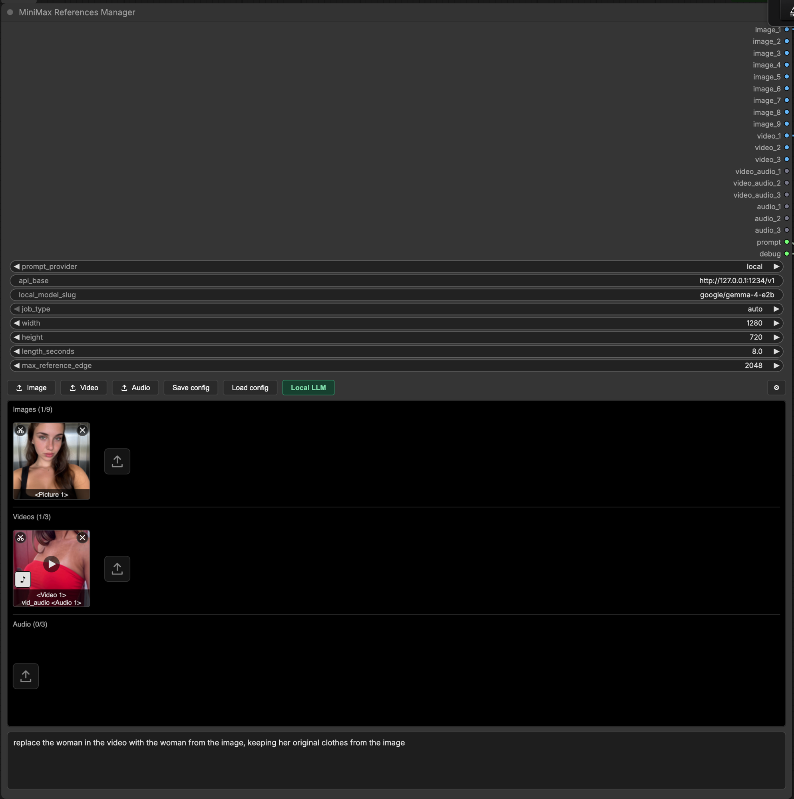

# MiniMax References Manager

One node that manages every reference for **MiniMax H3 Reference to Video**, writes the prompt for you, and saves the whole setup to a file you can carry between installs.



## Features

- **Upload instead of wiring.** Drop in images, videos and audio through the node's own UI. Preview them, play them, delete them, drag them into the order you want. No loader nodes, no links.
- **20 outputs, wired once.** Connect the 18 reference sockets plus `prompt` into `MiniMax H3 Reference to Video` and save the workflow. Change your references as often as you like, the graph never changes.
- **Auto prompting.** A multimodal model looks at your references, reads your direction text, and writes a full MiniMax H3 prompt in the exact six-section format the model expects.
- **Run it on your own machine.** `prompt_provider: local` points the prompt writer at any OpenAI-compatible server, so auto prompting needs no account and no key, and your references never leave the machine. Ollama, LM Studio, llama.cpp, vLLM, or anything else that speaks the same API.
- **It finds your server for you.** The **Local LLM** button sweeps the usual local ports, lists every server that answered and the models it holds, and fills in the URL and the model id in one click, so you never have to go looking for a base URL yourself. The scan is loopback-only and never resolves a hostname, so it cannot be turned into a port scanner.
- **Two registers.** `standard` writes a scene. `replacement` swaps one object or character in a reference video for the thing in a reference image. `auto` lets a cheap classifier pick.
- **Portable configs.** **Save config** downloads a JSON file to your machine. **Load config** reads it back on any install, on any pod, and restores your direction text, model, reasoning effort and reference list — including each reference's crop, trim, rotation and subject grouping.
- **The tags are on the tiles.** Every asset shows the label MiniMax will actually give it: `<Picture 2>`, `<Video 1>`, `<Audio 1>`. What you see is what you address in the prompt.
- **And they stay pointing at what you meant.** Tags are positional, so reordering, adding or deleting a reference, or toggling a video's soundtrack, renumbers the ones after it — including cases that look like a plain append, since a video's soundtrack takes an `<Audio N>` ahead of every standalone clip. Your direction text is rewritten to match, so `<Picture 2>` keeps meaning the image you wrote it about. Turn it off in the settings modal if you would rather edit by hand.
- **Video soundtracks come along.** A video's audio track is extracted and sent as its own reference by default. Toggle it off per video.
- **A `debug` output that shows the whole request.** Where it posted, the model, every setting, your direction, the target format, the reference manifest, and every content part numbered `[3/10]` with its type and size. It stubs the base64 out as `<BASE64_STRING>`, so the output stays readable. Wire it into any text preview node.
- **Honest about what it sent.** A local server takes text and images but not video or audio, so a clip goes as sampled frames with no sound. The node says so on the canvas, in the log and in `debug`, and it tells the prompt writer not to describe motion or voices it never received.
- **Prompt passthrough.** Set `prompt_provider` to `none` and your direction text goes straight to the `prompt` output with no API call.

## Do I need an API key?

No. `prompt_provider` picks who writes the prompt, and two of its three settings need no account at all.

| `prompt_provider` | What happens | Key |
| --- | --- | --- |
| `openrouter` | A hosted multimodal model writes the prompt. Videos go whole, with their sound. | Yes |
| `local` | Any OpenAI-compatible server on your own machine writes it. Nothing leaves the machine. | No |
| `none` | No call at all. Your `direction` text becomes the `prompt` output, word for word. | No |

Whichever you pick, you keep the whole reference manager: the uploads, the previews, the crop and trim editor, the `<Picture 2>` / `<Video 1>` / `<Audio 1>` tags, the portable configs, all 20 outputs wired once.

**Don't like the prompt it writes?** Open the node's settings modal (⚙) and edit the system prompt. It holds the full instructions the model gets. Rewrite it however you like, and it saves with the workflow. Leave it blank to use the packaged default.

There is **one prompt per register**, on their own tabs: `standard` writes a scene, `replacement` swaps one thing in a clip. They are separate 20KB+ files on purpose — the Ref2VA rules are hard formatting mandates, and putting both in context produces hybrids — so an override for one never reaches the other. The modal opens on whichever register your `job_type` will actually use.

## Running it locally

Start your server, then click **Local LLM** on the node. It looks for an OpenAI-compatible server on the machine ComfyUI is running on, lists what it found and which models each one holds, and picking a model sets `prompt_provider`, `api_base` and `local_model_slug` for you in one click.

Ports it looks at: 1234 (LM Studio), 11434 (Ollama), 8080 (llama.cpp), 8000 (vLLM), 1337 (Jan), 5000 (text-generation-webui) — **plus whatever is already in `api_base`**, when that address is on this machine. So a server on a port nobody standardised on is one paste and a **Rescan** away, rather than something the button can never see. The whole sweep takes about a second whatever is in the list. A port answering is not enough on its own, so it only reports a server whose reply actually looks like an OpenAI model list.

Nothing found? Start LM Studio's server from its Developer tab, or run `ollama serve`, then hit **Rescan**.

An `api_base` pointing off-box is left alone rather than probed, and the modal says so. That is the loopback rule below, not an oversight. Fill the three fields yourself:

```
prompt_provider  local
api_base         http://localhost:1234/v1     <- must end in /v1
local_model_slug google/gemma-3-4b
```

The scan is loopback-only by design. ComfyUI is often reachable by anyone holding its URL, so a scanner that would probe arbitrary hosts on request is not something this node should hand out. A remote server is typed in by hand instead.

Note `localhost` means the machine **ComfyUI** runs on, not the machine your browser is on. If ComfyUI is in Docker or on a pod, its localhost is not your laptop, and the scan will tell you so by finding nothing.

Leave `openrouter_api_key` empty. Local servers ignore it, and the node will not send a key from your environment to an address you typed in yourself. If your server does want one (vLLM started with `--api-key`), type it into the node and only that key is used.

**What you give up.** A local server takes text and images, not video or audio. So a reference video is sent as 6 still frames from across the clip, and no audio is sent at all, neither a video's soundtrack nor a standalone clip. The writer is told this and is instructed not to describe motion, cut rhythm or voices it was never given. Expect a weaker prompt than `openrouter` produces, especially for anything that depends on sound. The node says so on the canvas, in the log, and in the `debug` output, so you are never guessing which path ran.

Each provider reads its own model field and cannot see the other's: `openrouter` reads the `openrouter_model` dropdown, `local` reads `local_model_slug`. That is deliberate. A single shared field meant that configuring a local run and switching back to `openrouter` sent your local model id to OpenRouter, which answered `400: ... is not a valid model ID`.

## Install

```bash
cd ComfyUI/custom_nodes
git clone https://github.com/Hearmeman24/ComfyUI-MiniMaxRefPack
pip install -r ComfyUI-MiniMaxRefPack/requirements.txt
```

Restart ComfyUI.

## Example workflow

A complete Reference-to-Video graph ships with the pack: **Workflow → Browse Templates → ComfyUI-MiniMaxRefPack**, or drag `example_workflows/MiniMax R2V - Auto Prompting + Reference Manager.json` onto the canvas.

## OpenRouter key

Precedence on `prompt_provider: openrouter`: the node's `openrouter_api_key` box, then `OPENROUTER_API_KEY`, then `LLM_KEY`.

The `openrouter_model` dropdown lists only models that accept text, images, audio and video, and defaults to `google/gemini-3-flash-preview`. A key typed into the node is saved inside the workflow JSON, so use the environment variable if you share workflows.

On `prompt_provider: local` the environment is never read. Only a key typed into the node is sent, and only to the address in `api_base`, so a stray `OPENROUTER_API_KEY` cannot follow a pasted URL to somebody else's server.

## Settings

| Setting | What it does |
| --- | --- |
| `job_type` | `standard` / `replacement` / `auto`. `auto` only classifies when at least one video and one image are attached, and falls back to `standard` on any failure. |
| `reasoning_effort` | `none` / `low` / `medium` / `high`, default `medium`. Passed to OpenRouter, dropped for models that don't reason. |
| `width` / `height` / `length_seconds` | Told to the model so it composes for the real frame and keeps its cut timestamps inside the real duration. `0` leaves one unspecified. These do not set the output size, `Empty MiniMax H3 AV Latent` does. |
| `prompt_provider` | `openrouter` / `local` / `none`. See above. Replaces the old `use_openrouter` checkbox; workflows saved before 0.3.2 migrate automatically. |
| `api_base` | Base URL of your OpenAI-compatible server, used only when `prompt_provider` is `local`. Must end in `/v1`. |
| `openrouter_model` | The model that writes your prompt on `openrouter`. Ignored on every other provider. |
| `local_model_slug` | The model id your own server reports, used only on `local`. Ignored on every other provider. The **Local LLM** button fills it in. |
| `system_prompt` | The full instructions the model is given, editable in the settings modal and saved with the workflow. Blank uses the packaged default. Rewrite it if you want prompts in your own style. |
| `max_reference_edge` | Downscales a reference **image** whose long edge is bigger than this, `0` turns it off. Never upscales. Reference videos are already capped by the core node. |
| `local_ttl` | `local` only. Seconds your server should keep the model loaded after answering. `-1` (default) sends nothing. See below. |
| `local_server` | `local` only. `auto` / `lmstudio` / `ollama` / `generic` — decides what `local_ttl` is *called* on the wire. |
| `local_send_reasoning` | `local` only. Send `reasoning_effort` to your own server. Off by default. |
| `local_extra_body` | `local` only. A JSON object merged into the request as top-level fields. Applied last, so it overrides everything else. |

## Sharing a GPU with the model you're generating with

If the prompt writer runs on the same card as your diffusion model, it has to give the
VRAM back. A 27B Q4 vision model and a video model will not co-reside, and a JIT-loaded
writer that stays resident after answering costs you the generation it just wrote the
prompt for.

Both popular servers can unload on idle, and they disagree about what the field is called
**and** about what zero means:

| Server | Field | What `0` means there |
| --- | --- | --- |
| LM Studio | `ttl` | **Unset** — falls back to its 60-minute default. Use `1` for "unload now". |
| Ollama | `keep_alive` | Unload immediately. |

So `local_ttl` uses **`-1` as its off switch**, and anything `>= 0` goes on the wire
untouched, meaning whatever your server means by it. The node does not rewrite your
number, because there is no rewriting rule that is right for both.

`local_server` picks the field name. `auto` guesses from the port — 1234 is LM Studio,
11434 is Ollama — because an OpenAI-compatible `/v1` surface does not report what is
behind it. A port it does not recognise sends **no** idle-unload field rather than
guessing, and `debug` says so, since a TTL that silently did nothing looks exactly like
one that worked right up until the VRAM is still gone.

**Thinking models.** `local_send_reasoning` sends `reasoning_effort` to your server —
the flat field, which is what an OpenAI-compatible server takes, not the nested
`reasoning: {effort}` OpenRouter normalises. It is off by default because a plain server
is likelier to reject an unknown top-level field than ignore it. Turn it on with
`reasoning_effort: none` for a thinking checkpoint that would otherwise spend its whole
token budget reasoning and never reach the answer.

**Anything else**, put in `local_extra_body` as a JSON object — `{"top_k": 40}`. It is
merged last, so it beats the node's own guess. It may not set `messages` or `model`: the
node builds the first from your references and reports the second in `debug`, so
overriding either would make it disagree with what it actually sent.

## Telling it which references are the same subject

The written prompt's `subject_definitions` section labels the things the video is about —
`<Subject 1> is the woman in <Picture 1> and <Picture 2>` — and the model works out that
grouping by **looking** at your references. It is often right and sometimes not: three
photos of the same person from different angles are not always obviously three photos of
the same person.

Click a tile and a small grid appears inside it: an empty square for "none", then 1–9.
Clicking a number puts that reference in `<Subject N>`. The cells toggle and the picker
stays open, so a reference can join several subjects — a photo of a woman in a room is
both the character and the location — and you can work along a row one click per tile.
The numbers you have picked stay on the tile, bottom-right.

Whatever you group is sent as an explicit block the model is told to use rather than
re-derive. Videos carry their soundtrack's `<Audio N>` into the same subject, because a
character's clip and that character's voice are the same subject.

**The numbers are yours.** Pick 1 and 5 and the prompt says `<Subject 5>` — nothing is
renumbered or compacted behind your back.

## Rotating and mirroring a reference

The crop/trim editor (the scissors chip on a tile) has a **Rotate** row: ↺ ↻ for quarter
turns and ↔ ↕ for mirrors. A phone clip that arrives sideways is two clicks from being
right, and the turns are lossless — no resampling, the pixels are just re-indexed.

Two things it does that are easy to miss:

- **The crop rect turns with the frame.** A crop is stored as fractions, so turning the
  media without turning the rect would silently select a different region. Rotating both
  keeps the same pixels chosen.
- **A rotated clip stops taking the fast path to the prompt writer.** An untouched video
  is sent to the VLM as its own file bytes, which is right and quick. A rotated one is
  re-encoded first, because the sockets emit the rotated frames and showing the model the
  unrotated original would let it describe a video you are not generating.

**Any angle, not just quarter turns.** The slider beside the buttons rotates freely and
snaps to 0/90/180/270 within a few degrees — snapping matters because a quarter turn is
*lossless* (the pixels are re-indexed, not resampled) while any other angle re-renders
every frame of a clip, so a slider parked on 89.6° would cost a full re-encode and look
identical.

**Fit inside** decides what happens to the corners. Off (the default), the whole rotated
frame is kept and the empty corners are filled black. On, the result is bound to the
source's extent and the overhang is cropped away.

One thing a free angle deliberately does *not* do: rotate your crop rect with it. A
quarter turn maps a rect exactly; an arbitrary angle leaves it no longer axis-aligned,
and quietly substituting its bounding box would select pixels you never chose. The rect
stays where it is in the rotated frame — which is where the editor draws it.

## The tag rule

Worth reading once, because the numbering is what your prompt text refers to and it is
not always what you would guess — a video's soundtrack takes an `<Audio N>` *before* the
video takes its own `<Video N>`, so toggling one ♪ renumbers standalone clips too. The
node keeps your direction text in step with all of it (see above); this is what it is
keeping it in step with.

1. reference images, in order, become `<Picture 1..n>`
2. then each reference video: if its soundtrack is on, that soundtrack takes the next `<Audio j>` **first**, then the video takes `<Video k>`
3. then standalone audio, continuing the `<Audio j>` count

So a video's soundtrack is `<Audio 1>` even if you added a standalone audio clip before it. `<Video N>` and `<Audio N>` count independently.

## Reading and fixing tags in the prompt

Every tag in your direction text is highlighted where it sits — a quiet blue wash on a tag
that still points at a reference, an intense red one on a tag that points at nothing. It is
purely a tint behind the text: the prompt box types and edits exactly as normal.

A tag goes stray when the thing it named is gone. Deleting a reference rewrites its tag to a
placeholder — `<Picture #>`, `<Video #>`, `<Audio #>` — rather than silently letting it
inherit whatever took its old number, which would have left the sentence describing a
*different* reference with nothing to flag it. A number you typed past the end of a set
(`<Picture 4>` with three pictures) is stray for the same reason.

When any stray exists, a **Delete stray tags** button appears at the right of the subject
row; it strips every broken tag from the prompt in one go, and one Ctrl+Z brings them back.

## Limits

The model's limits, not the node's: 9 images, 3 videos, 3 soundtracks, 3 audio clips. Reference videos need at least 5 frames, get trimmed to MiniMax's 17k+5 frame grid, then capped to the length of the video you're generating. Clips are resampled to 24fps on the way in.

## Known issue

The packaged system prompt asks the model to give every label it defines in `subject_definitions` exactly one `retention_analysis` line, while MiniMax's guide says newly invented content gets no retention entry at all. When the model invents something the references didn't supply, it sometimes resolves that by dropping a label or inventing a line for one it never defined. The `debug` socket shows exactly what it was told.

## Licence

MIT. Free, and public on GitHub. Clone it, fork it, rip the prompt writer out and keep the reference manager, ship it inside something you sell. You do not need an account, and the node never calls home.
